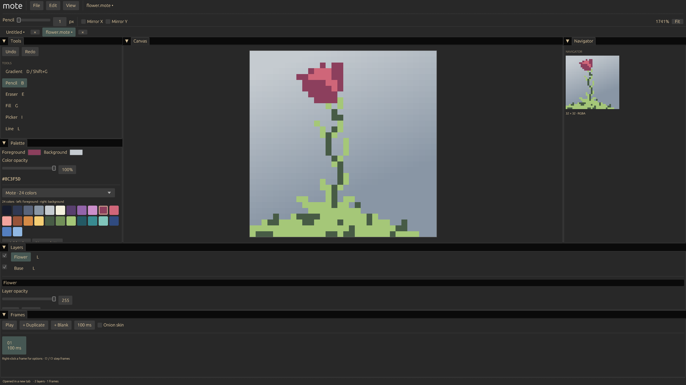

# Mote

A little canvas. Endless possibilities.

Mote is a native Rust pixel-art and animation editor for Omarchy. Draw sprites,
organize artwork into layers, build frame-by-frame animations, and export from
a compact workspace that follows your desktop theme.



Mote is an early alpha. Keep backups of important artwork. The published
**0.1.0** release contains the editor described here; AI-assisted generation is
being developed separately and is not included in this release.

## Features

- Pencil, eraser, fill, color picker, lines, rectangles and ellipses.
- Adjustable brushes, horizontal/vertical symmetry and color opacity.
- Smooth and dithered linear/radial gradients, palette ramps and custom palettes.
- Layers with visibility, opacity, locks, renaming, duplication and stacking order.
- Animation frames with individual timing, playback and previous-frame onion skin.
- Multiple document tabs with independent undo/redo and active-document saving.
- Movable, resizable panels, navigator, zoom, pan, pixel grid and tile preview.
- Rectangular selections, internal copy/paste, flips and canvas/sprite resizing.
- PNG, JPEG, lossless WebP, BMP, TGA and GIF export, sprite sheets and sequences.
- Customizable keyboard shortcuts and import/export of shortcut profiles.

Mote uses native Wayland/X11 windows and OpenGL rendering. Omarchy theme changes
restyle the interface without changing the artwork palette.

## Install

The initial release builds from source. Requirements: Git, mise, Rust 1.98, a C
compiler, pkg-config, Wayland/X11 development libraries, desktop-file-utils and
shared-mime-info. Runtime requirements include libGL/EGL, libxkbcommon, Wayland
or X11, and a working desktop file chooser portal with a backend.

Review the source and installation script, then run:

```sh
git clone --branch v0.1.0 https://github.com/benryanx/mote.git
cd mote
mise trust
mise exec -- bash scripts/install.sh
```

The installer builds with Cargo.lock and installs the binary in
`~/.local/bin`. Its desktop entry, icon and project MIME registration go under
`$XDG_DATA_HOME` (normally `~/.local/share`). No root access is required.
Setup may download Rust and Cargo dependencies.

Ensure `~/.local/bin` is in your desktop session's PATH, then launch **Mote**
from the application menu or run `mote` in a terminal.

To run from a source checkout:

```sh
mise exec -- cargo run --locked
mise exec -- cargo run --locked -- path/to/art.mote
```

## Optional Omarchy bar launcher

**Install the native application first.** This manual-setup plugin adds a bar
button that launches Mote; it does not build or install the executable.

```sh
omarchy plugin add https://github.com/benryanx/mote.git --enable
```

The plugin ID is `io.github.benryanx.mote`. The wrapper runs inside the existing
Omarchy shell and opens the editor in a separate native window. It does not
start a background service. The native installer does not alter desktop configuration.

## Getting started

1. Create a canvas or open a PNG or `.mote` project.
2. Select a layer, choose **Pencil**, and pick a color.
3. Add layers for separate elements and frames for animation.
4. Save as `.mote` to keep editable layers, frames and palette data.
5. Use **File → Export As** to create a separate image, sheet or animation.

Drawing affects the selected layer. A visible, unlocked top layer paints over
the layers beneath it; new layers are inserted above the selected layer.
Freehand strokes can leave the canvas and resume when the pointer returns.

**File → Canvas Size** expands or crops with an anchor position.
**File → Sprite Size** scales artwork using nearest-neighbor sampling.
Both affect all layers and frames and support undo.

## Default controls

| Action | Shortcut |
| --- | --- |
| Pencil / eraser / fill / picker | B / E / G / I |
| Line / rectangle / ellipse / selection | L / U / O / M |
| Gradient | D or Shift+G |
| Undo / redo | Ctrl+Z / Ctrl+Shift+Z or Ctrl+Y |
| New layer / duplicate layer | Shift+N / Ctrl+Shift+J |
| Blank frame / duplicate frame | Alt+Shift+N / Alt+N |
| Play / step frames | Space / Left and Right |
| New / open / save / save as | Ctrl+N / Ctrl+O / Ctrl+S / Ctrl+Shift+S |
| Export | Ctrl+Alt+Shift+S |
| Close tab / next tab | Ctrl+W / Ctrl+Tab |
| Copy / paste / deselect | Ctrl+C / Ctrl+V / Ctrl+D |
| Sample / swap colors | Alt+click / X |
| Zoom / pan | Mouse wheel / middle-button drag |

Open **Edit → Keyboard Shortcuts**, or press F1, to search commands and change
bindings. Desktop-reserved shortcuts may be intercepted by your compositor.
Mouse gestures and temporary Alt sampling are not remappable.

## Export

Export supports individual frames, grid sprite sheets, numbered image sequences
and GIF animations. Options include frame ranges and ordering, nearest-neighbor
scaling, transparency trimming, active-layer export, sheet columns/padding, GIF
looping and JPEG quality.

PNG, WebP and TGA retain alpha. JPEG is lossy; JPEG/BMP use an opaque background.
GIF has limited colors, binary transparency and 10 ms timing precision. WebP
export is static. Video export and packed-atlas metadata are not implemented.
Sequences are written to a new subfolder with numbered frames and timing metadata.
Saving an editable project remains separate from exporting.

## Data and limitations

- Project limits: 2048 pixels per side, 128 layers, 1024 frames, 16 million stored
  pixels across all cels, and 160 MB project input.
- Copy/paste is internal to Mote. Fill currently requires deselection.
- Custom palettes live at `$XDG_DATA_HOME/mote/palettes.json`.
- Modified documents receive recovery snapshots approximately every 30 seconds
  under `$XDG_STATE_HOME/mote/` (normally `~/.local/state/mote/`). Open recovery
  files manually. Snapshots are not a substitute for versioned backups.
- Workspace preferences persist, but open document tabs are not restored on restart.
- The 0.1.0 editor has no telemetry, network API, listener, browser or webview.
  It accesses selected artwork, theme files, preferences and recovery data.
  File dialogs use the desktop portal.

See [ROADMAP.md](ROADMAP.md) for planned work and [CHANGELOG.md](CHANGELOG.md)
for release notes.

## Update or remove

Save work and close Mote before updating. Obtain a newer reviewed source release
and rerun `mise exec -- bash scripts/install.sh`. This replaces the binary and
launcher assets, not your artwork.

Update the optional wrapper separately:

```sh
omarchy plugin update io.github.benryanx.mote
```

This updates the wrapper only, not the native executable.

Remove the native application from a source checkout:

```sh
bash scripts/uninstall.sh
```

Remove the optional wrapper separately:

```sh
omarchy plugin remove io.github.benryanx.mote
```

Application removal preserves artwork, preferences, custom palettes and recovery
files. The scripts do not remove project folders.

## Development

```sh
bash scripts/check.sh
```

Checks cover Rust tests, formatting, linting, the desktop entry, plugin manifest
and QML entry point. QML checks require Qt's qmllint and installed Omarchy shell
imports. See [RELEASE.md](RELEASE.md) for release validation notes.

## License and palette credits

Mote is [MIT licensed](LICENSE).

[Sweetie 16](https://lospec.com/palette-list/sweetie-16) is by GrafxKid;
[ENDESGA 32](https://lospec.com/palette-list/endesga-32) is by ENDESGA.
The Google-inspired palette is an unofficial selection of brand-like hues and
neutrals, not a device palette. Retro handheld and grayscale presets are
descriptive color sets. Palette sizes refer to color counts, not image bit depth.
